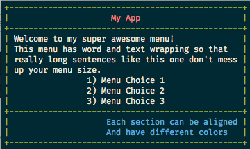

# Terminal Basic Menu
## Ruby Gem
### Version 1.1.0

This ruby gem can be used to generate menus for use with terminal apps.



## Installation
```
gem install terminal-basic-menu
```

## Requirements
Rainbow Gem v3.0.0:
```
gem install rainbow
```

## Functionality
- Up to three optional sections (Header, Body, Footer)
- Each Section can be seperately coloured and aligned.
- Body section can have list of choices.
- Word wrapping to keep text within menu width. (Optional)
- Each block of text can be aligned together or each line seperately aligned.

## Example Usage
```
header_text = 'My App'
header = { text: header_text, color: :red }
body_text = "Welcome to my super awesome menu!\nThis menu has word and text \
              wrapping so that really long sentences like this one don't mess up your menu size."
body_choices = ['Menu Choice 1', 'Menu Choice 2', 'Menu Choice 3']
body = {text: body_text, choices: body_choices, align: 'center', color: :white }
footer_text = "Each section can be aligned\nAnd have different colors"
footer = { text: footer_text, align: 'rjust', color: :blue }
menu1 = Menu.new(header: header, body: body, footer: footer)
menu1.border_color = :green
system('clear')
menu1.display_menu
```


## Menu configuration attributes
All options can be set using:
```
menu1 = Menu.new
menu1.attribute = new_value
```
- output
    - Used to set where the menu will be outputted (Default: $stdout)
- width
    - Used to set how many characters wide (Default: 50)
- header / body / footer
    - Accepts hash for each menu section.
    - text: Content to display
    - align: Where to align text (left/ljust/center/middle/right/rjust)
    - color: What color to display text
    - choices: Array of menu choices (Body section ONLY)
- border_color
    - Used to set color of menu borders
- word_wrap
    - Used to toggle automatic word wrapping ( true / false )
- block_align
    - Used to toggle block alignment ( true / false )

Some attributes can be set on menu creation:
```
menu1 = Menu.new(width: 100, header: {}, body: {}, footer: {}, border_color: :color)
```

### Available colors
Please see Rainbow [color list](https://github.com/sickill/rainbow#user-content-color-list)

## Please Note
Word wrapping will remove all empty white space and blank lines.
Can be turned off by setting word_wrap attribute to false.
```
menu1 = Menu.new
menu1.word_wrap = false;
```
